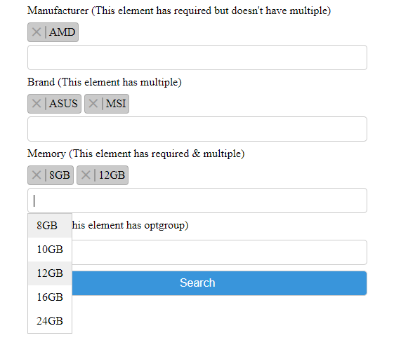

# select-multiple-search

Easy to use JS for searching on select option items.
####Example Screenshot


## Usage

### Import
```html
<link rel="stylesheet" href="select-multiple-search-ui.css">
<script src="select-multiple-search.js"></script>
<script>
    selectMultipleSearch('select_id');
</script>
```
##### Required
```html
<label for="manufacturer">Manufacturer (This element has required but doesn't have multiple)</label>
<select id="manufacturer" name="manufacturer" required>
    <option value="1">AMD</option>
    <option value="2">NVIDIA</option>
</select>
```
##### Multiple
```html
<label for="brand">Brand (This element has multiple)</label>
<select id="brand" name="brand[]" multiple>
    <option selected value="1">ASUS</option>
    <option value="2">ASROCK</option>
    <option value="3">EVGA</option>
    <option value="4">GALAX</option>
    <option value="5">GIGABYTE</option>
    <option selected value="6">MSI</option>
    <option value="7">SAPPHIRE</option>
</select>
```
##### Required & Multiple
```html
<label for="memory">Memory (This element has required & multiple)</label>
<select id="memory" name="memory[]" multiple required>
    <option selected value="1">8GB</option>
    <option value="2">10GB</option>
    <option selected value="3">12GB</option>
    <option value="4">16GB</option>
    <option value="5">24GB</option>
</select>
```
##### Using optgroup
```html
<label for="output">Output (This element has optgroup)</label>
<select id="output" name="output[]" multiple>
    <optgroup label="Display Port">
        <option value="1">DP 1</option>
        <option value="2">DP 2</option>
        <option value="3">DP 3</option>
        <option value="4">DP 4</option>
    </optgroup>
    <optgroup label="HDMI">
        <option value="5">HDMI 1</option>
        <option value="6">HDMI 2</option>
        <option value="7">HDMI 3</option>
        <option value="8">HDMI 4</option>
    </optgroup>
</select>
```
